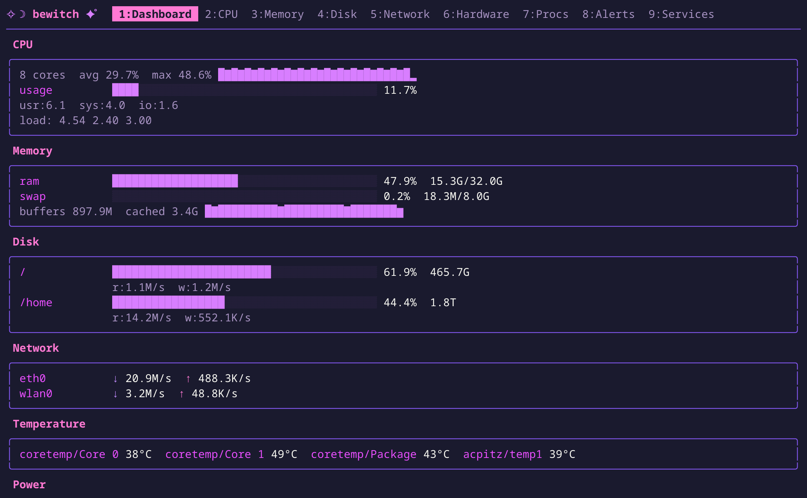
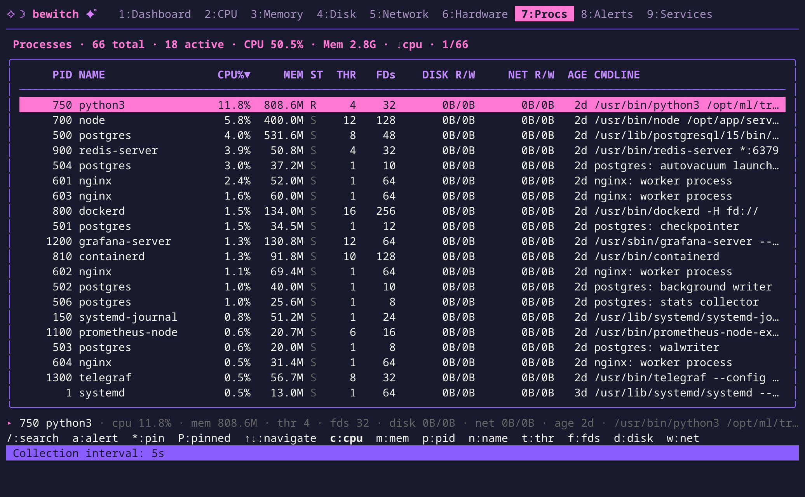
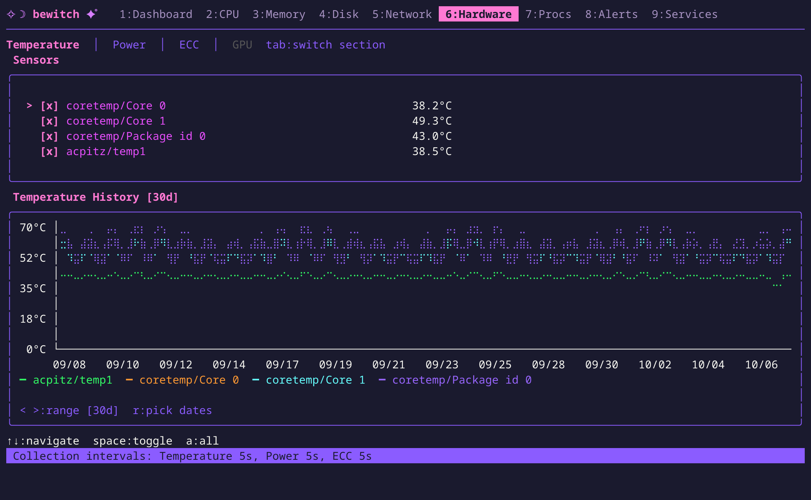
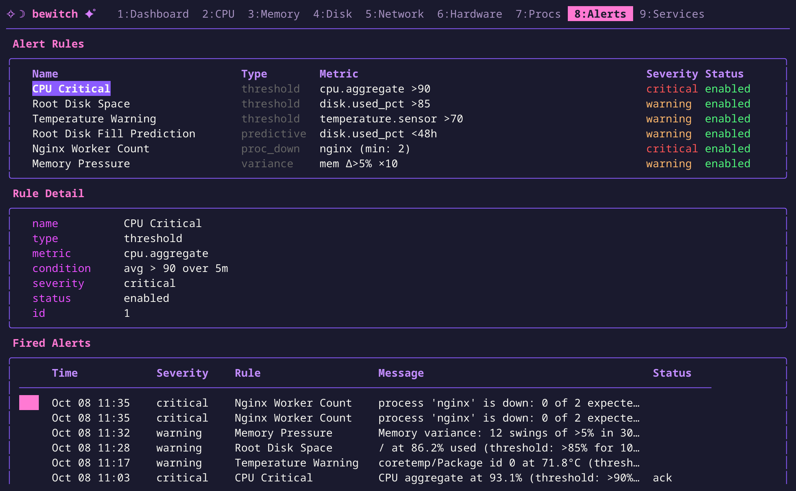
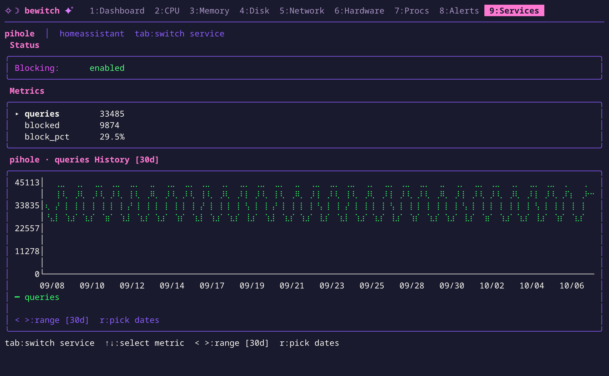
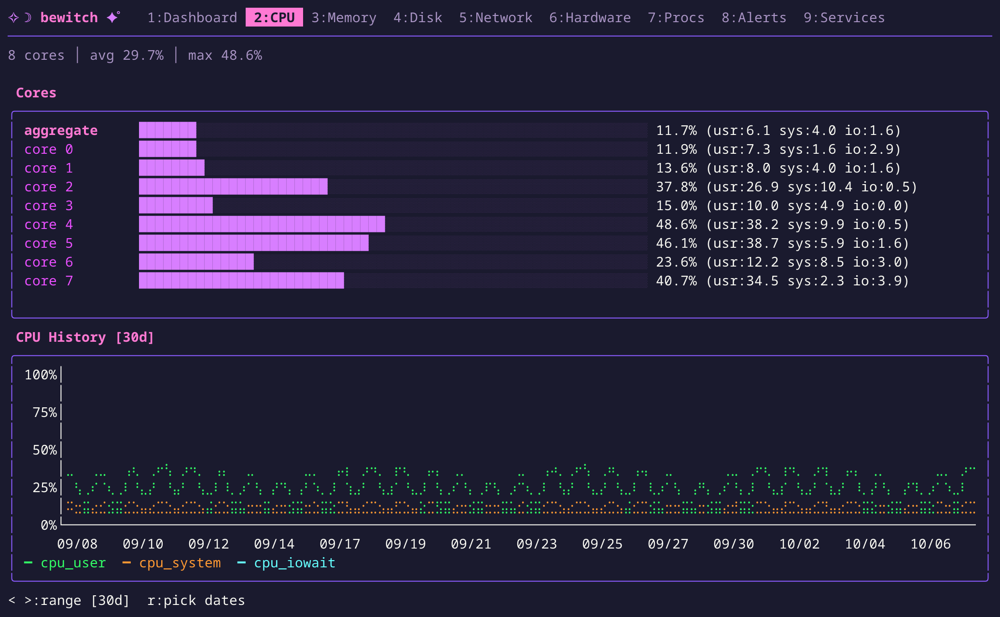
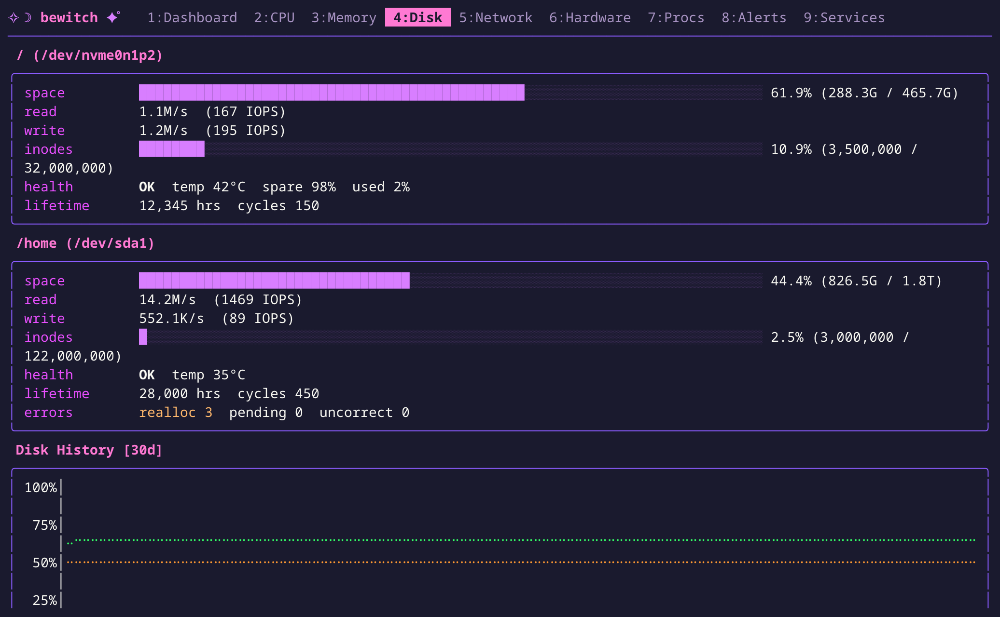

<p align="center">
  
</p>

<h1 align="center">bewitch</h1>

<p align="center">A Linux system monitor for the machines nobody else is watching.</p>

<p align="center">
  <a href="https://github.com/duggan/bewitch/actions/workflows/test.yml"></a>
  <a href="https://github.com/duggan/bewitch/releases/latest"></a>
  <a href="LICENSE"></a>
</p>



bewitch is two small binaries. `bewitchd` is a daemon that reads `/proc` and `/sys` and keeps months
of metrics in an embedded DuckDB database. `bewitch` is a terminal UI over them: live views,
history charts, SMART and hardware health, and alerts. It's built for homelabs (the basement
rack, the Raspberry Pi, that one VPS) and runs quietly as an unprivileged, sandboxed service on
small machines. It comes in one colour: hot pink.

## Install

```sh
curl -fsSL https://bewitch.dev/install.sh | sudo sh
```

On Debian and Ubuntu this adds the signed APT repository, so updates arrive with `apt upgrade`.
On other distributions it installs a prebuilt binary and a systemd service. Builds are available
for amd64 and arm64. See [Installation](https://bewitch.dev/docs/installation/) for the manual
APT setup, the dev channel, and tarballs.

## Use

```sh
bewitch                       # the TUI: 1–9 switch views, < > change the time range
bewitch repl                  # SQL over your own metrics
bewitch -addr myhost:9119     # a remote daemon, over TLS with fingerprint pinning
```

## What it does

- **Watches the whole machine:** CPU (per core, including steal), memory, disk space and I/O,
  network, temperatures, power (Intel/AMD RAPL), GPUs (Intel, NVIDIA, AMD), ECC memory, and every
  process, with per-process disk and network I/O.
- **Tracks disk health:** SMART for SATA and NVMe, stored over time, so you can watch a drive
  wear out and alert before it fails.
- **Keeps history:** months of metrics charted at any time range, with optional retention and
  Parquet archival.
- **Alerts:** threshold, predictive ("disk full in 48 hours"), variance and process-down rules,
  built in the TUI. Delivery by email, shell command, or Discord, Telegram, ntfy, Slack and more,
  with recovery notices and a dead-man's switch.
- **Watches your services too:** chart numbers from Pi-hole, Home Assistant, Docker, Proxmox VE or
  any JSON HTTP API, declared in TOML with no code.
- **Speaks SQL:** a REPL over everything it stores, export to CSV, Parquet or JSON, and a
  Prometheus `/metrics` endpoint.
- **Stays out of the way:** runs as its own unprivileged user in a hardened systemd sandbox, with
  TLS and token authentication for remote access.

## A look around

| Processes | Hardware |
| --- | --- |
|  |  |
| **Alerts** | **Services** |
|  |  |
| **CPU** | **Disk** |
|  |  |

## Documentation

Full documentation is at **[bewitch.dev/docs](https://bewitch.dev/docs/)**:

- [Configuration](https://bewitch.dev/docs/configuration/) and [Collectors](https://bewitch.dev/docs/collectors/)
- [TUI guide](https://bewitch.dev/docs/tui/) and [Alerts](https://bewitch.dev/docs/alerts/)
- [Custom sources](https://bewitch.dev/docs/custom-sources/) and [Running on Proxmox VE](https://bewitch.dev/docs/proxmox/)
- [SQL REPL](https://bewitch.dev/docs/repl/), [Storage & archival](https://bewitch.dev/docs/archival/) and the [API](https://bewitch.dev/docs/api/)
- [Remote access](https://bewitch.dev/docs/remote-access/)

## Development

bewitch targets Linux, but builds and runs on macOS too: mock mode generates synthetic data for
every view, so you can work on the TUI anywhere. You need Go (see `go.mod`) and a C toolchain,
because DuckDB is linked through cgo.

```sh
make build              # bin/bewitchd and bin/bewitch
make test               # unit tests (make test-integration for the DuckDB ones)
```

To run against mock data, use a config like this:

```toml
[daemon]
mock = true
socket = "/tmp/bewitch.sock"
db_path = "/tmp/bewitch.duckdb"
```

```sh
bin/bewitchd -config dev.toml &
bin/bewitch -config dev.toml
```

[CLAUDE.md](CLAUDE.md) has detailed architecture notes for contributors.

## License

[Apache 2.0](LICENSE)
